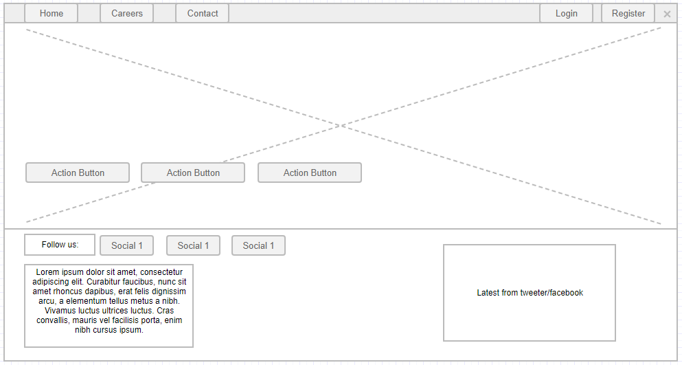
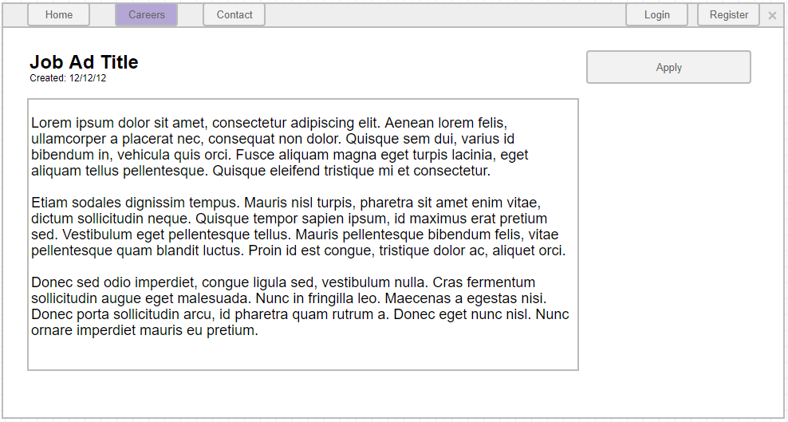
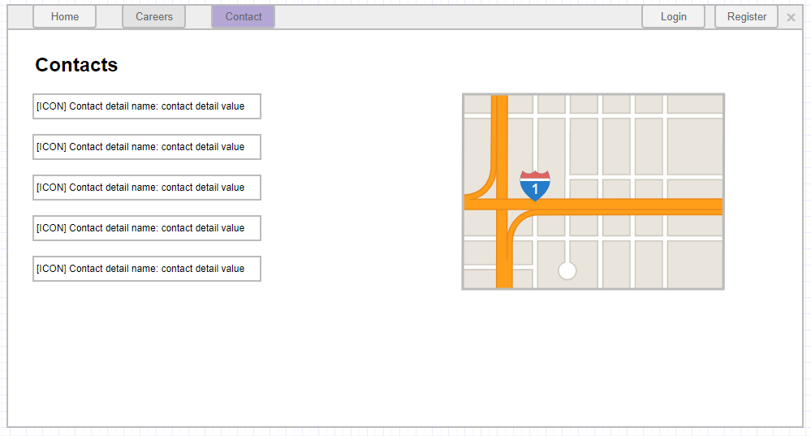
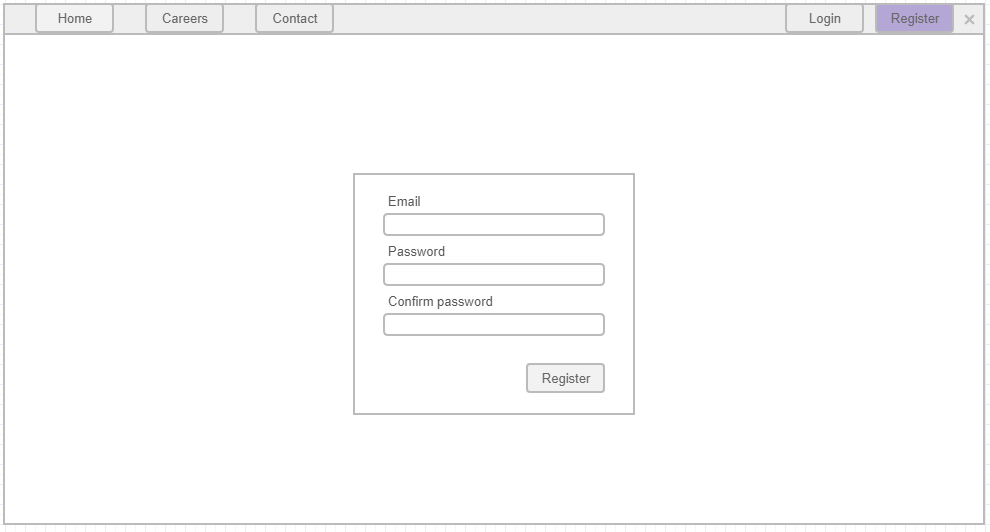
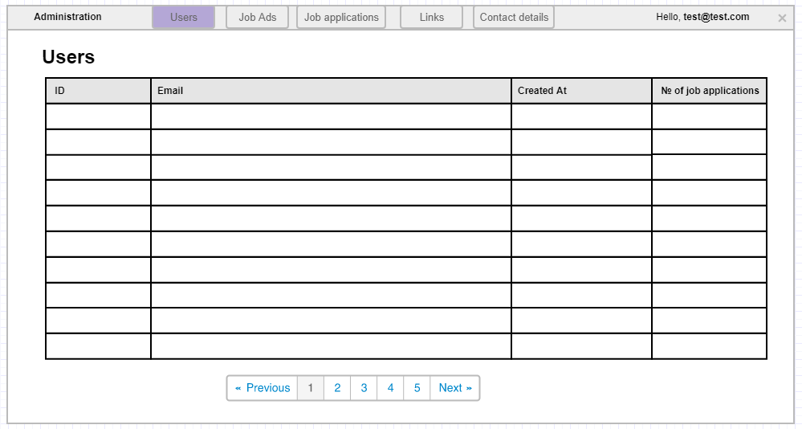
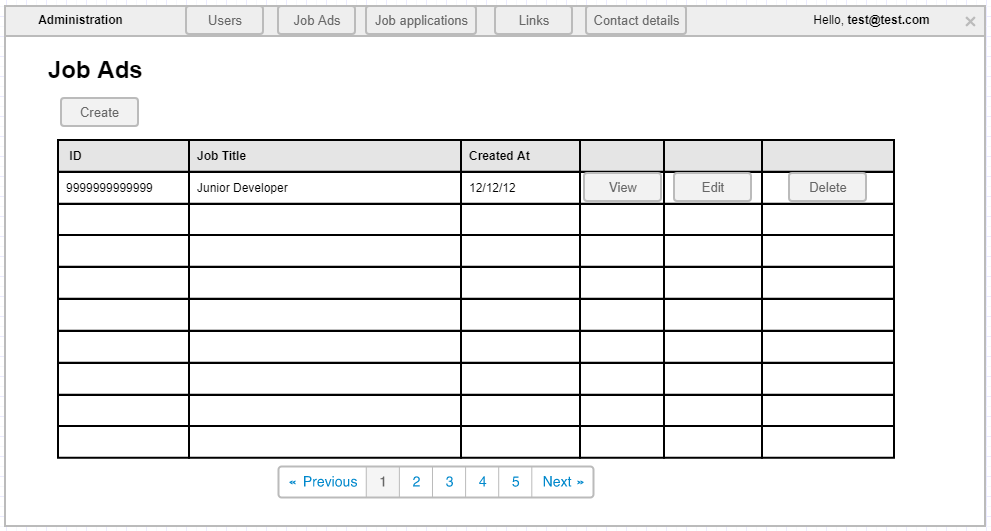
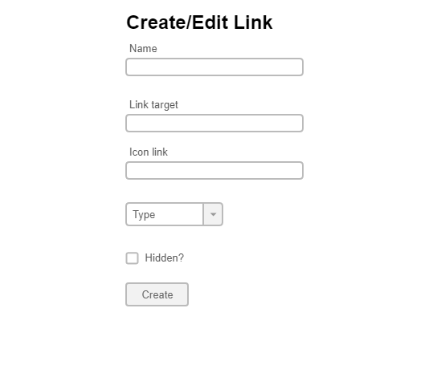

# Project Company Life

This document service as a general overview of the all the topics related to the construction of the project in question.

## General description

The purpose of this project is rather straight forward - create a web application that can serve as a marketing site for a company. The web site should contain the following functionality:

- A configurable landing page.
- A section with job ads.
- The ability for users to apply for a job ad.
- An interface for managing all applications by the system administrators.
- A configurable about/contacts page.

For a detailed information about each feature, please refer to the `User stories` section of this document.

## User Stories

This section describes all the required users stories that need to be completed in order for the project to be ready for use.

### Web application layout

TODO

---

### Landing page

This page is the default home page for our application It displays some basic information:

- Dynamic list of action buttons.
- Dynamic list of social buttons.
- A configurable free text
- Configurable background image.
- A list of the latests tweets/facebook posts.

#### Page wireframe

#### Acceptance criteria

1. When navigating to the app root we should see the Home page.
2. When clicking on the home button form the navigation bar, the home page should be opened.
3. The image background for the home page should be configurable via the project environment variables or a JSON file configuration.
4. When a user clicks an action button he should be redirected to the respective web address.
5. The dynamic action button list should be customizable from the administration.
6. The dynamic social button list should be customizable from the administration.
7. A social button should have a icon and a link.
8. When a user clicks on social button, he should be redirected to the respective url link.
9. The free text under the social button list, should be configurable via via the project environment variables or a JSON file configuration.
10. The home page should display the latest twitter or facebook items from the organization twitter/facebook page.

---

### Job listing

This page allows potential applicants to browse open positions in the company. Additionally, the user can filter the job ads by some a set of criteria.

#### Page wireframe

#### Acceptance criteria

1. When a user clicks on the Careers button in the navigation he should be redirected to the Job listings page.
2. A job ad should have a title, description, type(IT, Sales, Marketing, etc.), creation date, status(Open, Closed).
3. The page should display a list of 10 open positions + paging if there are more than 10 open positions.
4. The user should be able to filter the jobs by a search term. The search should be using the title an the description of the job ad.
5. The user should be able to filter the job ads by job type.
6. The user should be able to filter the jobs by a create after date filter.
7. All the filters should be able work together. Example: I should be able to search for jobs that have the keyword `TypeScript`, are of job type `IT` and are created after the Sunday of last week.
8. If the user clicks on the paging he should be shown the next 10 job ads.
9. If the user clicks the reset all filter button, all filters should be removed.
10. When a user clicks on a job ad, he/she should be redirected to the Job ad details page.
11. The user should NOT be able to view closed job ads.
12. The administrator should be able to view closed job ads.
13. If there are no job ads, the paged list is replaced with the message `There are no open positions - please try later`.

---

### Job ad details

This page gives the user more details about a job ad and allows him/her to apply for that position.

#### Page wireframe

#### Acceptance criteria

1. When a user clicks on a job ad, he/she should be redirected to the Job ad details page.
2. The user should see the Job title, when the ad was created and the detailed description of the add.
3. The user should be able to click the apply button.
4. If the user is logged in, he/she should be redirected to the Job application page.
5. If the user is NOT logged in, he/she should be redirected to the login registration page. After the authentication process is complete, he should be redirected to the job application page.
6. If the job ad that the user is trying to access is closed, he should be redirected to the Home page.
7. If an administrator is trying to access a closed job ad, this should be possible.
8. If the user is an administrator, he as an additional button `Show all applications`, that redirects him to the view job applications administration.

---

### Contacts

This page provides basic contact details to the user and offers a Google maps integration for easy address display.

#### Page wireframe

#### Acceptance criteria

1. When a user clicks on a job ad, he/she should be redirected to the Job ad details page.
2. The user should see a list of contact details for the company.
3. The contact details list should be dynamic and should be loaded from the Mongo.
4. A contact details has a name, a value, an isPrimaryAddress flag and an icon.
5. The user should see a Google maps with the location of the company. The address should be extracted as the value of the first contacts details entry that has the isPrimaryAddress flag set to true.
6. If there are multiple contacts details entries that have the isPrimaryAddress flag set to true, take only the first and ignore the rest.

---

### Register new user

This page allows the user to register a new user in the application.

#### Page wireframe

#### Acceptance criteria

1. When a user clicks on the Register button in the navigation he should be redirected to the Register user page.
2. If the user enters an invalid email, there should be an error message. (Example of invalid emails: aaaaaa, 99999, ____).
3. If the email already exists in the database the user should receive an error message.
4. If the user enters different values the `Password` and `Confirm password` fields, he should receive an error.
5. If the user enters a password that does not have a minimum of 8 characters, at least 1 upper case letter, 1 digit and 1 special symbol, he should receive an error.
6. If the user enters more than 256 symbols in the password field he should receive a error.
7. If the user enters an email, that has more than 1024 characters, he should receive an error.
8. The `Register` button, should be inactive, before every field in the register for is valid.
9. If the user clicks the Register button, when all the fields are valid, he/she should be redirected to the home page and login/register buttons in the nav bar should be replaced with `Hello {email}` message.
10. If the user is already signed in, he should not be able to access the Register user page.

---

### Login user

This page allows the user to login an existing user in the application.

#### Page wireframe

#### Acceptance criteria

1. When a user clicks on the Login button in the navigation he should be redirected to the Register user page.
2. If the user enters an invalid email, there should be an error message. (Example of invalid emails: aaaaaa, 99999, ____).
3. The password field must have a value before the form is submitted.
4. The `Login` button should be disabled if there are invalid fields in the login form.
5. If the user clicks `Login` button, all the fields are valid, BUT his login information is invalid, he/she should be presented with an error message.
6. If the user clicks `Login` button, all the fields are valid and his login information is valid, he/she should be redirected to the home page and login/register buttons in the nav bar should be replaced with `Hello {email}` message.
7. If the user checks the `Remember me?` checkbox, he/she should remain logged in even if the closes the browser.

---

### Job application

This page allows a logged in user to apply for a job ad.

#### Page wireframe

#### Acceptance criteria

1. When a user clicks on the Apply button in a job ad and if he is logged in, he is redirected to the Job application page.
2. The user MUST enter their first name.
3. A valid first name is considered a string, containing only alphabetical characters, and that has a length between 3 and 100 characters.
4. The user MUST enter the a last name.
5. A valid last name is considered a string, containing only alphabetical characters, and that has a length between 3 and 100 characters.
6. The user MAY enter an additional comment.
7. The additional comment must be at most - 1024 symbols.
8. The user MUST upload their CV.
9. The maximum size of a CV document is 16 mb.
10. The user MAY upload a cover letter.
11. The maximum size of a cover letter document is 16 mb.
12. If the user does not meet any of the required criteria and tries to submit the job application - a error message is displayed.
13. The `Submit` button should be disabled if there is any invalid fields in the form.

---

### List users administration

### Job application

This page allows administrators to view all the registered users in the application.

#### Page wireframe

#### Acceptance criteria

1. When a user clicks on the Users button in the administration part of the application he is redirected to the Users administration page.
2. All the users a displayed in a grid, and each users must have an unique database id, his email, when he was registered and how many jobs he has applied for.
3. If there are more than 10 users in the application, a paging mechanism is shown.
4. The administrator can sort by each column.
5. If there are no users in the application, a `No data available` message should be present.

---

### List job ads administration

This page allows administrators to view all the job ads users in the application, add new ones and delete/edit exiting ones.

#### Page wireframe

#### Acceptance criteria

1. When a user clicks on the Job Ads button in the administration part of the application he is redirected to the Job ads administration page.
2. If there are more than 10 job ads in the application, a paging mechanism is shown.
3. The administrator can sort by each column (except the action columns).
4. If there are no job ads in the application, a `No data available` message should be present.
5. If the user clicks the `Create` button he/she is redirected to the Create Job ad administration page.
6. If the user clicks the `View` button, he/she is redirected to the Job ad details page.
7. If the user clicks the `Edit` button, he/she is redirected to the Create Job ad administration page but with already field details.
8. If the user clicks the `delete` button, a `Are you sure` confirmation window pops up.
9. If the user clicks `Yes` if the delete confirmation window, the row entry is deleted form the database and the grid is updated.
10. If the user clicks `Cancel` if the delete confirmation window, the window closes and nothing else happens.

---

### Create/edit job ad administration

This page allows administrators to create or edit a job ad.

#### Page wireframe

#### Acceptance criteria

1. When a user clicks on the `Create` button in the Job ad administration he/she is redirected to the Create Job ad administration page.
2. The user must enter a title with a minimum character length 4 and maximum length 256.
3. The user must enter a job add description with a minimum character length 4 and maximum character length 16384.
4. For the description a WYSIWYG editor must be available for the user.
5. The user must select the job category for this ad - the available predefined categories are - IT, Marketing, Sales, Operations, Other.
6. The user must select the status of this add - Active or Inactive.
7. The `Create` button must be disabled if there are any errors in the form.
8. When the user clicks the `Create` button and all the form fields are valid, a new job ad is created, which has its CreatedAt value set to the moment of the ad creation.
9. After the ad is created the user is redirected to the Job ads list administration page.

---

### List job applications administration

This page allows administrators to view all the job applications for a specific job ad.

#### Page wireframe

#### Acceptance criteria

1. When a user clicks on the Applications button in a job ad he is redirected to the Job Applications administration page.
2. The user sees ONLY the job applications for a specific ad.
3. If there are more than 10 job applications for the job ad, a paging mechanism is shown.
4. The administrator can sort by each column (except the action columns).
5. If the user clicks the `Download CV` button, the upload CV file for that application is downloaded.
6. If the user clicks the `Download Cover Letter` button, the upload CV file for that application is downloaded.
7. The Name column of the grid must contain the first and the last name of specified in the application.
8. There must be an additional column for the email of the user that sent the application(not shown in the wireframe). When the user clicks the email, it opens a mailing client.

---

### List links administration

This page allows administrators to view all the job ads users in the application, add new ones and delete/edit exiting ones.

#### Page wireframe

#### Acceptance criteria

1. When a user clicks on the Links button in the administration part of the application he is redirected to the Links administration page.
2. If there are more than 10 links in the application, a paging mechanism is shown.
3. The administrator can sort by each column (except the action columns).
4. If there are no Links in the application, a `No data available` message should be present.
5. If the user clicks the `Create` button he/she is redirected to the Create Link administration page.
6. If the user clicks the `Edit` button, he/she is redirected to the Create Link administration page but with already field details.
7. If the user clicks the `Delete` button, a `Are you sure` confirmation window pops up.
8. If the user clicks `Yes` if the delete confirmation window, the row entry is deleted form the database and the grid is updated.
9. If the user clicks `Cancel` if the delete confirmation window, the window closes and nothing else happens.
10. There must be an additional column for the link type(not shown in the wireframe).

---

### Create/edit link administration

This page allows administrators to create or edit links.

#### Page wireframe

#### Acceptance criteria

1. When a user clicks on the Create button in the Links administration he/she is redirected to the Link create administration page.
2. The link must have a new that is between 3 and 128 characters. If that is not the case the user will get an error message.
3. The link target field must have a value. If that is not the case the user will get an error message.
4. The icon link field must have a value. If that is not the case the user will get an error message.
5. The user must choose choose a type for the link - the predefined types are action link and social link. The default value in the dropdown is social link.
6. If the user marks the `Hidden?` the link should not be displayed in the UI.
7. If there are any invalid fields in the form, the `Create/Edit` button should be disabled.
8. When the user clicks the `Create` button and all the form fields are valid, a new link is created, which has its CreatedAt value set to the moment of the link creation.
9. After the link is created the user is redirected to the Links administration page.

---

### List contacts details administration

This page allows administrators to view all the contact details in the application, add new ones and delete/edit exiting ones.

#### Page wireframe

#### Acceptance criteria

1. When a user clicks on the Contact details button in the administration part of the application the user is redirected to the Contact details administration page.
2. If there are more than 10 contact details in the application, a paging mechanism is shown.
3. The administrator can sort by each column (except the action columns).
4. If there are no contact details in the application, a `No data available` message should be present.
5. If the user clicks the `Create` button he/she is redirected to the Create Contact details administration page.
6. If the user clicks the `Edit` button, he/she is redirected to the Create contact details administration page but with already field details.
7. If the user clicks the `Delete` button, a `Are you sure` confirmation window pops up.
8. If the user clicks `Yes` if the delete confirmation window, the row entry is deleted form the database and the grid is updated.
9. If the user clicks `Cancel` if the delete confirmation window, the window closes and nothing else happens.

---

### Create/edit contacts details administration

This page allows administrators to create or Contact details. 

#### Page wireframe

#### Acceptance criteria

1. When a user clicks on the Create button in the Contact details administration he/she is redirected to the Contact details create administration page.
2. The name of the contact detail must be between 2 and 128 characters. If that is not the case the user will get an error message.
3. The value of the contact detail must be between 2 and 1024 characters. If that is not the case the user will get an error message.
4. If the users marks the `Is map address?` checkbox an integrated Google map is shown in the Contacts page with the value of the current contact for an address.
5. When the user clicks the `Create` button and all the form fields are valid, a new contact detail is created, which has its CreatedAt value set to the moment of the link creation.
6. If there are any invalid fields in the form, the `Create/Edit` button should be disabled.
7. After the link is created the user is redirected to the Links administration page.

---

## Technical Stack

The core technical stack for this application should be the MEAN stack.

## Proposed Architecture

This following section describes a proposed architecture they may or may not be used by the development team.

The suggested architecture is composed of the following sub projects:

- Front-End - the purpose of this project is to visualize our data take user input while transmitting it to the back-end. This projects contains the following sub components:
        - Angular UI - this components deals ONLY with the visualization of data
        - Service Layer - this is the home of all the our data communication logic sending POST/GET/PUT/DELETE requests to the back-end, should be done through here.

- Back-End - the purpose of this project is to abstract any communication with the data source a provide a clean Web API interface for our UI to consume. This projects contains the following sub components:
        - Express Controllers/Routes layer - this component house all the express routing logic and exposes a valid REST CRUD API for our front-end to consume.
        - Service Layer - this the home of all our data storage and validation logic. If we want to store something in our database, we should go through here.

- Data storage - the is the persistent storage for our system - in our case this is going to be, the Mongo Database.

## General pointers

These points bellow are recommendations, that the authors think may be of use to the developers of this system.

- It is highly recommended to use Angular Material([https://material.angular.io/](https://material.angular.io/)) components and NOT write everything from scratch.
- The wireframe images are NOT to be taken as 100% accurate - use imaganation and common sense.

## Challenges

If you manage to complete the whole project before the deadline, here are some additional challenges:

- Implement 3rd party authentication using Facebook, Tweeter, Github and Google.
- Make a new administration for the Job Category and use it to dynamically create job categories.
- Generate a test coverage report for the application.